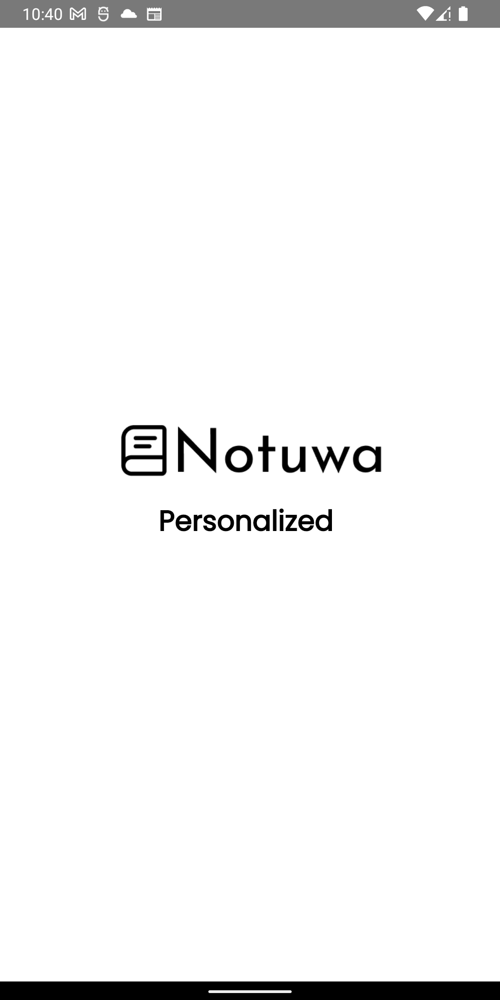

# Note Taking App Notuwa

This is a note-taking app built using Flutter, which allows users to create and update notes along with attaching photos. The app provides options for user registration or Google sign-in to access its features.

## Features

- **User Registration:** Users can create their accounts within the app using email and password for authentication.

- **Google Sign-In:** Alternatively, users can choose to sign in using their Google accounts for quick access and ease of use.

- **Create Notes:** Once authenticated, users can create new notes by providing a title, content, and optionally, attach a photo from their device's gallery or take a new photo using the camera.

- **Update/Delete Notes:** Users have the ability to edit their existing notes, change titles, content

## Requirements

To run this app locally or deploy it on a device, you will need the following:

- **Flutter:** The app is built using Flutter, so you should have the Flutter SDK installed on your system. For instructions on installing Flutter, visit the official Flutter website: [https://flutter.dev/docs/get-started/install](https://flutter.dev/docs/get-started/install)

- **Android Studio:** To run the app on Android and iOS devices respectively, you will need Android Studio set up on your machine.

## Getting Started

##### **Clone the repository** to your local machine:
#
```bash 
git clone https://github.com/Sushil787/Notuwa.git
```
##### install/update pacakge
#
``` bash 
flutter pub get
```
##### 


To run this app locally or deploy it on a device, you will need the following:

- **Flutter:** The app is built using Flutter, so you should have the Flutter SDK installed on your system. For instructions on installing Flutter, visit the official Flutter website: [https://flutter.dev/docs/get-started/install](https://flutter.dev/docs/get-started/install)

- **Android Studio:** To run the app on Android and iOS devices respectively, you will need Android Studio set up on your machine.


## Configuration

Before running the app, you need to configure Firebase for authentication and database storage. Follow these steps to set up Firebase:

1. Go to the Firebase Console [https://console.firebase.google.com/](https://console.firebase.google.com/) and create a new project.

2. In the Firebase project settings, locate and copy the `google-services.json` (for Android) and `GoogleService-Info.plist` (for iOS) files provided by Firebase.

3. Place the `google-services.json` file in the `android/app/` directory and the `GoogleService-Info.plist` file in the `ios/Runner/` directory.

4. Enable Email/Password and Google Sign-in methods in the Firebase Authentication settings.

5. Enable Firestore database in the Firebase Database settings.


##### flutter run
#
``` bash 
flutter run
```

## Folder Structure

The app's codebase is organized as follows:
```
lib
├── core
│   ├── assets
│   │   └── media_assets.dart
│   ├── constants
│   │   ├── app_constants.dart
│   │   └── route_constants.dart
│   ├── helper
│   │   ├── extension
│   │   │   ├── context_extension.dart
│   │   │   └── string_extension.dart
│   │   ├── gap.dart
│   │   └── network_info.dart
│   ├── routes
│   │   └── app_router.dart
│   ├── storage
│   │   ├── data
│   │   └── domain
│   ├── theme
│   │   ├── app_colors.dart
│   │   ├── app_theme.dart
│   │   └── theme_cubit.dart
│   └── widgets
│       ├── custom_button.dart
│       ├── custom_textfield.dart
│       └── splash_screen.dart
├── di
│   ├── app_module.dart
│   ├── di_setup.config.dart
│   └── di_setup.dart
├── features
│   ├── notes
│   │   ├── cubit
│   │   │   ├── note_cubit.dart
│   │   │   └── note_state.dart
│   │   ├── data
│   │   │   ├── data_source
│   │   │   └── repository
│   │   │       └── note_repo_impl.dart
│   │   ├── domain
│   │   │   ├── model
│   │   │   │   └── notes_model.dart
│   │   │   └── repository
│   │   │       └── note_repository.dart
│   │   ├── home_screen.dart
│   │   ├── main_screen.dart
│   │   ├── note_screen.dart
│   │   ├── presentation
│   │   └── widgets
│   │       ├── bottom_modal_sheet.dart
│   │       └── note_widget.dart
│   └── user
│       ├── data
│       │   ├── model
│       │   │   └── user_model.dart
│       │   ├── remote_data_source
│       │   │   └── user_remote_data_source_impl.dart
│       │   └── repository
│       │       └── user_repository_impl.dart
│       ├── domain
│       │   ├── entities
│       │   │   └── user_entity.dart
│       │   └── repository
│       │       ├── user_remote_data_source.dart
│       │       └── user_repository.dart
│       └── presentation
│           ├── cubit
│           │   ├── credential
│           │   │   └── cubit
│           │   │       ├── auth_cubit.dart
│           │   │       └── auth_state.dart
│           │   └── profile
│           │       └── cubit
│           │           ├── profile_cubit.dart
│           │           └── profile_state.dart
│           └── ui
│               ├── all_user_screen.dart
│               ├── login_screen.dart
│               ├── profile_screen.dart
│               ├── signup_screen.dart
│               └── widgets
│                   └── profile_widget.dart
├── firebase_options.dart
├── main.dart
└── observer.dart
```

## Images 
<p>
  
  
    
      
</p>


## Contributing

Contributions to the project are welcome! If you find any issues or want to add new features, feel free to submit a pull request.

## License

This project is licensed under the MIT License.

## Contact

If you have any questions or need further assistance, feel free to contact the project maintainers at `xushilgyawali@gmail.com`.


